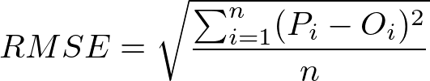

# Machine Learning Engineer Nanodegree
## Capstone Proposal

Franklin Bradfield  
June 25th, 2017

### Domain Background

The human race has a long history of trying to predict the future, ocassionally successfully, but more often than not to little avail. Of all the diverse fields that machine learning has been introduced to the past several decades, time series forecasting stands out as one of the most prominent and impactful for practitioners and stakeholders alike. Time series forecasting is concerned with predicting the future behavior of variables based on past behavior and other factors. It assumes that there are one or more patterns in a variable over time that can be quantified and captured, which can in turn be used for predicting its direction out to various points in the future. Businesses don't have to look far to find clear use cases where machine learning can prove itself as a powerful tool that they can apply to solve problems involving time series. Demand and cost forecasting are immediately obvious, however in principal machine learning could be useful in any case where a business keeps historical data that tracks a metric over time. Time series data is all around us, therefore being able to predict it accurately remains a goal to which many researchers have applied their efforts. A few of the fields in which time series analysis has proven invaluable include:

- Finance [1] [2] [5]
- Healthcare [6]
- Energy [3]
- Meteorology [7]
 
Prediction is not a novel problem and certainly not one for which machine learning is the only useful tool. Time series forecasting is a part of the broader field of predictive analytics, which includes machine learning, but also utilizes a variety of statistical approaches that do not necessarily involve machine learning. Autoregressive integrated moving average (ARIMA) is a linear regression technique that is frequently applied in finance to predict the future value of financial assets [2]. This model requires takes three parameters - *p,d,q* - and is fitted to time series data and then used to make predictions. One drawback of ARIMA is that the user must estimate a priori the values for *p, d,* and *q* to be used in fitting. This often requires a strong grasp of the underlying statistics if one wants to produce good results. He or she could also perform exhaustive or random search to find optimal values, but there are still various issues such as trend, seasonality, and noise that one must account for. For these reasons, ARIMA is not a kind of "plug-and-play" black-box model that a beginner can pick up and start working with quickly. It also becomes more and more expensive to train models *p* is increased. I have found that past *p = 18*, the model becomes prohibitively expensive to train, but perhaps better hardware could mitigate this issue. Further details on how ARIMA works and what *p, d,* and *q* refer to will be detailed in the final report.

Deep learning on the other hand has also been used to successfully model forecast time series data. Traditional multilayer-perceptrons (MLPs) have been employed with varying degrees of success [3] [4] [5] [7], but more often than not the tools of choice for time series data are different variations of recurrent neural networks (RNNs), namely the long short-term memory (LSTM) network [6], which excel in capturing both long and short-term dependencies between time steps. Recurrent neural networks are famous for their use in natural language processing, which can be viewed as another manifestation of the class of **sequence** problems, of which time series forecasting is also a member. Deep learning approaches have demonstrated superior results on time series problems as compared with traditional methods [3] [5], however this pattern doesn't always hold, for example in more simple cases where short-term dependencies are all that is needed to make predictions [4]. In the report, I will discuss further how ARIMA and RNNs differ fundamentally in the way they model and forecast sequence data, as understanding this will highlight the types of problems for which each approach is most suitable.

The motivation for this project is to add to the body of research that compares traditional statistical methods with deep learning techniques to time series forecasting. I will use the field of commercial aviation as my testing ground for comparing ARIMA, MLPs, and RNNs. To my knowledge, no public research that involves deep learning has been conducted in this area, although I'm sure major airlines themselves time series forecasting very seriously within their organizations. It is my opinion that the question of which approach is better has not yet been answered conclusively. It may be that the proper choice of model is wholly dependent on the specific problem one is trying to solve, and that one should consider the various benefits and trade-offs of each approach before settling on a choice. To this end, I will also discuss the limitations and drawbacks of each model and comment on which aspects of problems invalidate the use of certain approaches.

### Problem Statement

The question that this project seeks to answer can be detailed as such:

- Can deep learning techniques, specifically recurrent neural networks (RNNs), be used to accurately predict future time series data in the commercial aviation industry?

ARIMA with a simple configuration of *{p = 12, d = 1, and q = 2}* will serve as the baseline statistical model to compare the performance of RNNs against. In both cases, the models will seek to minimize the root mean-squared error of their predictions. A solution will have been found if RNNs consistently achieve strong performance on the prediction task across several different datasets. The data used in this project is not static, with new additions being added by the source once a month. This creates an ongoing opportunity for the performance of the model to be evaluated so that improvements can implemented as they are discovered. Although this project specifically focuses on aviation data, it is intended to serve as a **proof-of-concept** for the use of RNNs applied to time series data in general. If the results are successful, then this will further support research that shows RNNs a strong candidate for a variety of time series problems.

### Datasets and Inputs

The data to be used in this project comes from datasets that the U.S. Department of Transportation makes publicly available on their website [1]. The U.S. DoT collects data on a variety of modes of transportation, however my analysis will be limited to monthly aviation data that is available for 15 U.S. airlines and 30 major U.S. airports. Data is released from this source on a three-month lag. As of this writing (June 25th, 2017), the latest available data on the website comes from March 2017 [2]. Based on these numbers, there should be 450 airline-airport dataset combinations, however this is not exactly the case since not every airline serves every airport. For example, Virgin American has no service at Hartsfield-Jackson Atlanta International Airport. Even for datasets that exist, not all are complete because a given airline may not have had operations at a given airport for the entire duration. Alaska Airlines only began servicing Atlanta in 2009 for instance. On this note, complete dataset currently consists of 174 observations for every month from October 2002 to March 2017.

For the reasons outlined above, only three to five datasets will be selected from the source and run through my models. My plan is to use data on Delta Airlines flights originating in Atlanta, United Airlines flights originating in Chicago, and American Airlines flights originating in Dallas/Fort Worth. These three airlines maintain headquarters in the cities in which these three airports are located, therefore the data is clean, complete, and assumed to be more reliable for extracting patterns and making predictions than other airline-airport combinations. Only domestic data on the number of monthly flights, passengers, revenue-passenger miles, and airline seat-miles will be considered, making for a total of twelve datasets. Specific definitions for these terms are detailed in the appendix. The plan to use this specific data is tentative at this point, because I do not know how my approach will perform. If RNNs perform strongly on these datasets, then I may attempt to apply them to airline-airport combinations for which the data is noisier and/or sparser. This will allow me to test the limits of my approach and find the point at which performance breaks down. Plots of example datasets are shown in the appendix as well.

Monthly domestic aviation data was chosen as ideal time series data for applying machine learning for a variety of reasons. Annual or quarterly data is too sparse to be of use. Daily time series would provide a larger and possibly richer dataset, however the signal to noise ratio would almost certainly be unacceptably low. Monthly data thus represents a happy medium between these two extremes. Although the source provides data on both domestic and international flights, the latter will not be included in my models because the tables frequently have many missing values these columns. Unlike data on the prices of stocks and other financial instruments, I estimate that flight data is not as stochastic, i.e. there are not as many random influences that determine its direction. Furthermore, aviation is non-stationary and subject to various trends and cycles, some long-term, some short-term or seasonal. This makes for a complex yet reasonably tractable problem for which machine learning is strong candidate to tackle.

One aspect of the data that adds a challenge to this project is getting access to it. Although the data on the website is presented in a clear tabular format, the U.S. DoT doesn’t make it easy to extract in a downloadable and shareable format such as JSON or CSV as many other government sources do. One could simply copy and paste the desired data into a spreadsheet, however with the amount of possible datasets available, this could quickly become tedious. An automated process would be more efficient. To this end, I have built a web scraping script in Python that can automatically create an HTTP session, send a request to the server where the data is located, bring back what is desired, and transform it into reusable CSV file. This basis for this script was taken from Udacity’s Data Wrangling with MongoDB course [3], although it has undergone significant modification and extension on my part. For convenience, I have included in this repository the complete datasets for the three airline-airport combinations that I’m planning to use. The script is included as well for those interested in testing it or using it to pull their own data from the source.

### Solution Statement

### Benchmark Model

ARIMA with a simple configuration of *{p = 12, d = 1, and q = 2}* will serve as the baseline statistical model to compare the performance of RNNs against. Explanation of why these values were chosen is out of the scope of this proposal, but will be explained in the report. Note that the chosen set of parameters is not necessarily the optimum, but merely a baseline from which future comparisions can be made. As can be seen in the charts below, the performance of the baseline model is mixed. The R-Squared column shows that it performs exceptionally well on the metrics for Delta-Atlanta, however it is not all that impressive for United-Chicago and American-Dallas/Fort-Worth.

**Delta-Atlanta**

| (12, 1, 2)        |       RMSE    |       R-Squared    |         
| :---------------: | :------------:|:------------------:|
| Passengers        |        71,966 |        0.8560      |     
| Flights           |        796    |        0.5373      |     
| ASM               |        29,750 |        0.9505      |     
| RPM               |        47,057 |        0.8768      |    

**United-Chicago**

| (12, 1, 2)        |       RMSE    |       R-Squared    |         
| :---------------: | :------------:|:------------------:|
| Passengers        |        82,259 |        0.4166      |     
| Flights           |        813    |        -0.4338     |     
| ASM               |        80,846 |        0.3458      |     
| RPM               |        56,085 |        0.6885      |   

**American-Dallas/Fort-Worth**

| (12, 1, 2)        |       RMSE    |       R-Squared    |         
| :---------------: | :------------:|:------------------:|
| Passengers        |        62,497 |        0.4191      |     
| Flights           |        386    |        0.2401      |     
| ASM               |        45,090 |        0.6670      |     
| RPM               |        106,479|        -0.1861     |   

### Evaluation Metrics
The metric to be used for evaluating the performance of RNNs and ARIMA against each other is the root mean-squared error defined below:

Where $ P_{i} $ equals the predicted value and $ O_{i} $ equals the observed value for a given time step. 

One issue that using RMSE creates involves the scales on which each metric is measured. For example, a typical model predicting passenger data might produce a RMSE of 75,000 while one predicting flight data produces one of 400. Because passenger and flight data necessarily exist on vastly different scales of measurement, these two RMSE are not comparable. Standardization or normalization of the data prior to training and testing is not desirable because then the original units are lost and each RMSE itself becomes uninterpretable. In order to provide a more apples-to-apples comparison of the performance of models across datasets, I will also report the R-Squared ($ R^2 $). In plain terms, the $ R^2 $, also known as the coefficient of determination measures how well one set of data can explain variation in another. If two sets A and B have an $ R^2 $ of 0.9, then it means that A can explain 90% of the variation in B. In other words, A is a strong predictor of B. I've included the formula for $ R^2 $ below for reference. **The best performing model for each dataset will not be selected based on the highest R-Squared, but on the lowest RMSE. R-Squared will simply be reported alongside the lowest RMSE.**

### Project Design

### Appendix

#### References

[1] Aas, K., & Dimakos, X. K. (2004). Statistical modelling of financial time series. Norwegian Computing Center. Retrived from https://www.nr.no/files/samba/bff/SAMBA0804.pdf

[2] Adebiyi, A. A., Adewumi, A. O., & Ayo, C. K. (2014). Stock Price Prediction Using the ARIMA Model. International Conference on Computer Modelling and Simulation 2014. Retrived from http://ijssst.info/Vol-15/No-4/data/4923a105.pdf

[3] Falode, O., & Udomboso, C. (2016). Predictive Modeling of Gas Production, Utilization and Flaring in Nigeria using TSRM and TSNN: A Comparative Approach. Open Journal of Statistics, 6(1), 194-207. Retrieved from http://www.scirp.org/journal/PaperInformation.aspx?PaperID=63994

[4] Gers, F. A., Eck, D., & Schmidhuber, J. (2001). Applying LSTM to time series predictable through time-window approaches. International Conference on Artificial Networks 2001 (pp. 669-676). Retrieved from https://link.springer.com/chapter/10.1007/3-540-44668-0_93.

[5] Kohzadi, N., Boyd, M. S., Kermanshahi, B., & Kaastra, I. (1996). A comparison of artificial neural network and time series models for forecasting commodity prices. Neurocomputing, 10(2), 169-181. Retrieved from http://www.sciencedirect.com/science/article/pii/0925231295000208

[6] Lipton, Z. C., Kale, D. C., Elkan, C., & Wetzel, R. (2016). Learning to diagnose with LSTM Recurrrent Neural Networks. International Conference on Learning Representations 2016. Retrieved from https://arxiv.org/abs/1511.03677.

[7] Voyant, C., Nivet, M. L., Paoli, C., Muselli, M., & Notton, G. (2014). International Conference on Mathematical Modeling in Physical Sciences 2014. Meteorological time series forecasting based on MLP modelling using heterogeneous transfer functions. Retrieved from https://arxiv.org/abs/1404.7255.

[8] https://www.transtats.bts.gov/

[9] https://www.transtats.bts.gov/Data_Elements.aspx?Data=2 

[10] https://www.udacity.com/course/data-wrangling-with-mongodb--ud032

#### Definitions

\* *Revenue passenger-miles: Number of miles flown by billed passengers. Reported in millions.*

\* *Available seat-miles: Number of miles flown by available seat capacity. Reported in millions.*

#### Plots

