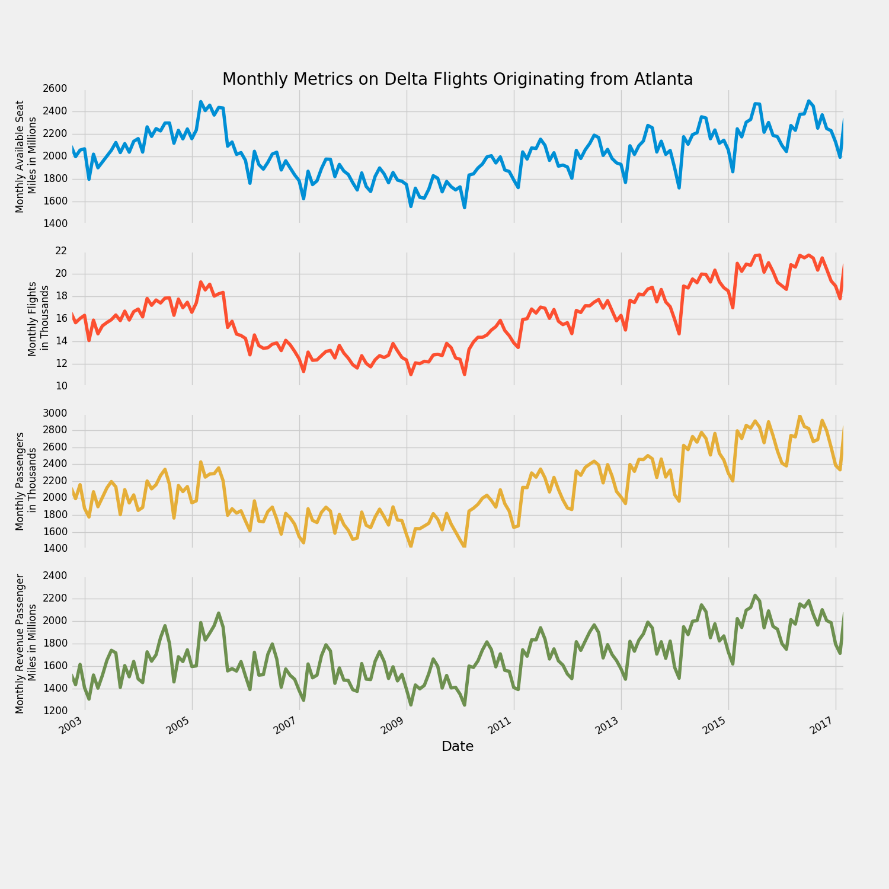
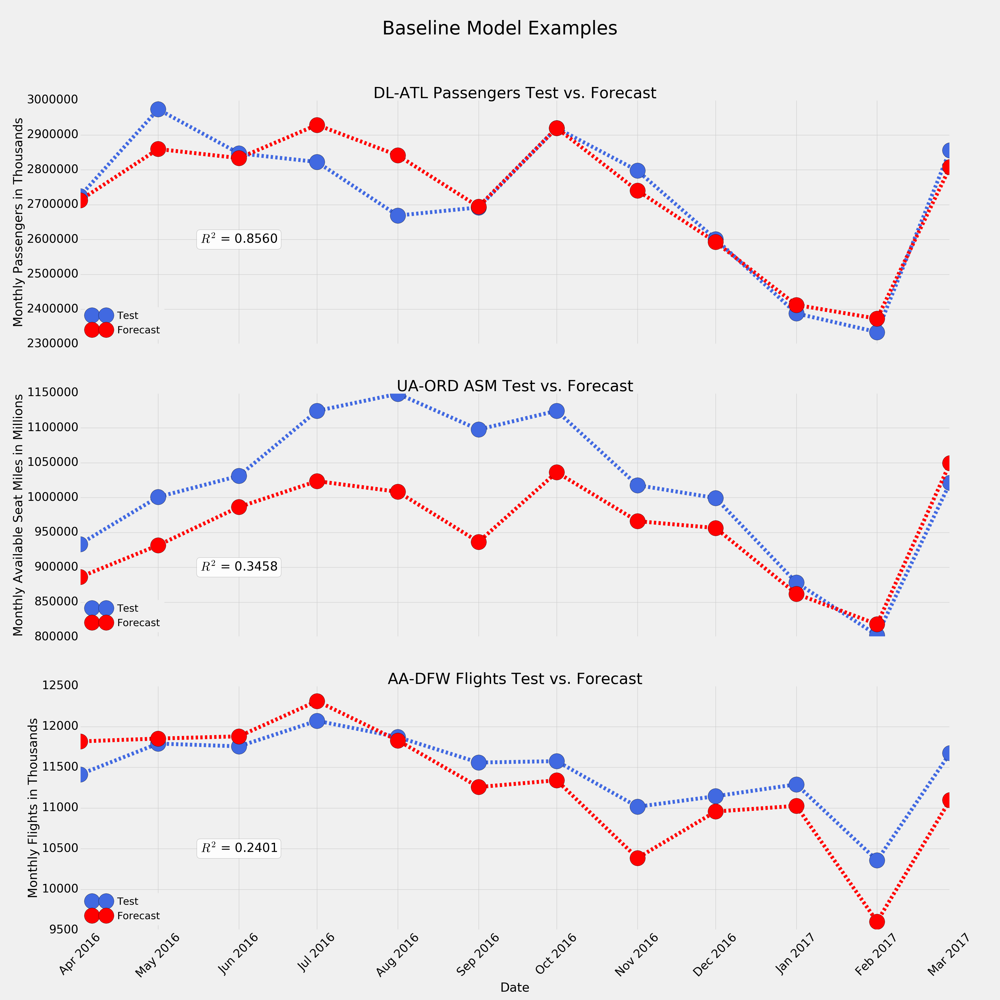

# Sky Cast
## Capstone Proposal

Franklin Bradfield  
July 3rd, 2017

### Domain Background

The human race has a long history of trying to predict the future, ocassionally successfully, but more often than not to little avail. Of all the diverse fields that machine learning has been introduced to the past several decades, time series forecasting stands out as one of the most prominent and impactful for practitioners and stakeholders alike. Time series forecasting is concerned with predicting the future behavior of a random variable based on its past behavior as well as exogenous factors where necessary. It assumes that there are one or more patterns in a given variable that emerge over time that can be quantified and modelled. Once a model's parameters are fitted to past data, it can in turn be used for predicting direction out to various points in the future. Examples of common patterns include trends, seasonality, and Gaussian noise. 

Businesses don't have to look far to find clear use cases where machine learning can prove itself as a powerful tool that they can apply to solve problems involving time series. Demand and cost forecasting are immediately obvious, however in principal machine learning could be useful in any area where a business keeps historical data. Time series data is all around us, therefore being able to predict it accurately remains a goal to which many researchers have applied their efforts. A few of the fields in which time series forecasting has proven invaluable include:

- Finance [1] [2] [5]
- Healthcare [6]
- Energy [3]
- Meteorology [7]
 
Prediction is not a novel problem and certainly not one for which machine learning is the only useful tool. Time series forecasting is a part of the broader field of predictive analytics, which includes machine learning techniques, but also utilizes a variety of traditional statistical approaches as well. Autoregressive integrated moving average (ARIMA) is a regression technique that is frequently applied in finance to predict the future value of financial assets [2]. This model takes three parameters - *p,d,q* - and is fitted to time series data and then used to make predictions. One drawback of ARIMA is that the user must estimate a priori the values for *p, d,* and *q* to be used in fitting. This often requires a strong grasp of the underlying statistics if one wants to produce good results. He or she could also perform exhaustive or random search to find optimal values, but there are still various issues such as trend, seasonality, and noise that one must account for. For these reasons, ARIMA is not a kind of "plug-and-play" black-box model that a beginner can pick up and start working with quickly. It also becomes more and more expensive to train ARIMA models as *p* is increased. I have found that past *p = 18*, ARIMA becomes prohibitively expensive to train, but perhaps better hardware could mitigate this issue. Further details on how ARIMA works and what *p, d,* and *q* represent will be detailed in the final report.

Deep learning on the other hand has also been used to successfully forecast time series data. Traditional multilayer-perceptrons (MLPs) have been employed with varying degrees of success in this domain [3] [4] [5] [7], but more often than not the tools of choice for time series data are different variations of recurrent neural networks (RNNs), namely the long short-term memory (LSTM) network [6], which excels in capturing both long and short-term dependencies between time steps. Recurrent neural networks are famous for their use in natural language processing, which can be viewed as another manifestation of the class of **sequence** problems, of which time series forecasting is a member. Deep learning approaches have demonstrated superior results on time series problems as compared with statistical methods [3] [5], however this pattern doesn't always hold, for example in more simple cases where short-term dependencies are all that is needed to make predictions [4]. In the report, I will discuss further how statistical methods and deep learning differ fundamentally in the way they model and forecast sequence data, as understanding this will highlight the types of problems for which each approach is most suitable.

The primary motivation for this project is to add to the body of research that compares traditional statistical methods with deep learning techniques to time series forecasting. I will use the field of commercial aviation as my testing ground for comparing ARIMA, MLPs, and RNNs. In doing so, I'll have to chance to create models that could be of practical benefit to the industry as well. To my knowledge, no public research that involves neural networks has been conducted in this area, although I'm sure major airlines themselves take time series forecasting seriously within their organizations. In an industry where excess capacity equals wasted expenditure and where insufficient capacity equals lost revenue, it is imperative for airlines to be able to forecast demand with the greatest degree of accuracy as possible. Having robust prediction models for quantities such as next year's passenger count could ensure that sufficient resources were allocated in advance to handle incoming demand. This is but one example of the practical applications of this project.

Between statistical methods and neueral networks, it is my opinion that the question of which approach is "better" has not yet been answered conclusively. It may be that the proper choice of model is wholly dependent on the specific problem one is trying to solve, and that one should consider the various benefits and trade-offs of each approach before settling on a choice. To this end, I will also discuss the limitations and drawbacks of each model and comment on which aspects of time series problems validate or invalidate the use of certain approaches.

### Problem Statement

The question that this project seeks to answer can be detailed as such:

- Can future data in the commercial aviation industry be accurately forecasted based solely on past data using techniques from time series regression and/or deep learning?

Specifically, the task is to make yearly forecasts by predicting time series data from April 2016 to March 2017 using only data from the same series from October 2002 to March 2016 for training and validation. In other words, the first 162 values serve as input data and the final 12 as the output. There are four streams of data that will be involved for each month: the number of passengers, number of flights, the total available seat-miles (ASM), and the total revenue passenger-miles (RPM). This leads to four separate models and four scores for any airline-airport combination. Although data on each type is reported on a discrete scale, in practice forecasting their future values is treated as a regression problem because their totals typically reach the tens or hundreds of thousands. As such, fractional values that arise in forecasts will be rounded to the nearest whole number. More details on the types of data are included in the table below. 

|     *Type*       |                      *Definition*                             |		
|:---------------: | :------------------------------------------------------------:|
|   Passengers     | Number of passengers that flew in the month                   |
|   Flights        | Number of flights that were conducted in the month            |
|   ASM            | Number of available seats  *  Number of miles flown           |
|   RPM            | Number of revenue paying passengers  *  Number of miles flown |

In a real-world scenario, including additional time series features such as monthly employment and inflation statistics might improve forecast accuracy but that is out of the scope of this project. ARIMA, MLPs, and RNNs will be compared based on their Root Mean Squared Error (RMSE) and R-Squared Score (*R2*) between the 12-month forecasts and the testing data. The data used in this project is not static, with new additions being added by the source once a month. This creates an ongoing opportunity for the performance of models to be evaluated so that improvements can be tested and applied as they are devised. Although this project specifically focuses on commerical aviation data, it is further intended to serve as a **proof-of-concept** for the use of RNNs applied to time series data in general, as their success in this domain is still emerging in the literature. If their results are successful, then this will further support research that indicates RNNs being a strong candidate for a variety of time series problems.

### Datasets and Inputs

The data for used in this project comes from datasets that the U.S. Department of Transportation makes publicly available on their website [9]. The U.S. DoT collects data on a variety of modes of transportation, however my analysis will be limited to a portion of monthly aviation data that is available for 15 U.S. airlines and 30 major U.S. airports. Data is released from this source on a three-month lag. As of this writing (July 3rd, 2017), the latest available data on the website comes from March 2017 [10]. Based on these numbers, there should be 450 airline-airport dataset combinations, however this is not exactly the case since not every airline serves every airport. For example, Virgin American has no service at Hartsfield-Jackson Atlanta International Airport. Even for datasets that exist, not all are complete because a given airline may not have had operations at a given airport for the entire duration. Alaska Airlines only began servicing Atlanta in 2009 for instance. On this note, a complete dataset currently consists of 174 observations for every month from October 2002 to March 2017. For the these reasons, only three datasets will be selected from the source and run through my models. My plan is to use data on Delta Airlines flights originating in Atlanta, United Airlines flights originating in Chicago, and American Airlines flights originating in Dallas/Fort Worth. These three airlines maintain headquarters in the cities in which the airports are located, therefore the data is clean, complete, and assumed to be more reliable for extracting patterns and making predictions than other airline-airport combinations. Only domestic data on will be considered on the four types of data listed in the problem statement, making for a total of twelve time series. Plots of example datasets are shown in Figure 3 of appendix.

Monthly domestic aviation data was chosen as ideal time series data for applying machine learning for a variety of reasons. Annual or quarterly data is too sparse to be of use. Daily data would provide a larger and possibly richer set, however the signal to noise ratio would almost certainly be unacceptably low. Monthly data thus represents a happy medium between these two extremes. Although the source provides data on both domestic and international flights, the latter will not be considered in this project because this column frequently has many missing values. Unlike data on the prices of stocks and other financial instruments, I estimate that flight data is not as stochastic, i.e. there are not as many random influences that determine its direction. Furthermore, aviation data is non-stationary and subject to various trends and cycles, some long-term, some short-term and seasonal. In the report, I will provide charts that quantify the stationarity of each time series. This makes for a complex yet reasonably tractable problem for which regression and machine learning are strong candidates to tackle. One may wonder however, if only 174 observations warrant the use of a neural network approach, or whether or not that would be enough to train such models. The reason that I have for taking this approach comes from several successful experiences in applying RNNs to similarly sized time series datasets where the trajectory was not especially erratic. To get good results, I may have to get creative with the way that I split up the series into sequences for fitting and predicting. Any data preparation steps that were undertaken to produce certain results will be documented in the report. 

One aspect of the data that adds a challenge to this project is getting access to it. Although the data on the website is presented in a clear tabular format, the U.S. DoT doesn’t make it easy to extract in a downloadable and shareable format such as JSON or CSV as many other government sources do. One could simply copy and paste the desired data into a spreadsheet, however with the amount of possible datasets available, this could quickly become tedious. An automated process would be more efficient. To this end, I have built an easy-to-use [web scraping script](https://github.com/shellshock1911/Sky-Scrape) in Python that can automatically create an HTTP session, send a request to the server where the data is located, bring back what is desired, and transform it into reusable CSV file. The basis for this script was taken from Udacity’s Data Wrangling with MongoDB course [11], although it has undergone significant modification and extension on my part. For added convenience, I have included in this repository [the three complete datasets](https://github.com/shellshock1911/Sky-Cast/tree/master/aviation_data) that I’m planning to use. 

### Solution Statement

A solution will have been found if either ARIMA or neural networks, are able consistently achieve strong performance on the prediction task across the range of time series in the problem. In my view, an *R2* greater than 0.90 between forecasted and test data represents solid predictive capacity, while 0.95 or greater would be exceptional. Ideally in the course of forecasting, one of the approaches emerges as superior over the other so that a broad judgement can be made on each one's overall merits and faults. One of the biggest issues that one must be aware of when making future predictions based on past data is overfitting. Extensive regularization measures will be taken relevant to both ARIMA and neural networks to avoid committing this error. Deploying the models on multiple datasets and time series can make the presence of overfitting more obvious if it is indeed occurring. Finally, the source allows for continual testing as new data becomes available to judge whether or not overfitting took place on the original time series. All of this helps ensure that any particular solution is general, replicable, and applicable across varied problem domains.

### Benchmark Model

ARIMA with a simple configuration of *{p = 12, d = 1, and q = 2}* serves as the baseline statistical model to compare the performance of tuned ARIMA and neural networks against. Prior to fitting the training data, seasonality was captured and removed from each time series. Because the transformed series were still non-stationary and demonstrated evidence of evolving trends, a difference factor *d* of 1 was chosen in an attempt to discount the trends and render the series as stationary as possible prior to fitting regression parameters. Period lag *p* of 12 was used so that each fitted value could be represented as a function of the values through the previous 12 months and their respective weight parameters. The assumption here is that when trend is discounted, a given year of values in a series should reflect its past year to a reasonable extent. Error lag *q* of 2 is a safe point to start from so that the model can consider how recent noise in the series has influenced the current direction. While the *p* coefficients help ARIMA capture and carry the year-to-year pattern, the *q* coefficents help it detect and respond to sudden changes in direction. After fitting the models and making forecasts for the final 12 months, seasonality was added back in so that predictions could be scored directly against the raw test data. 

Note that the chosen set of parameters is not necessarily the optimum for all or any of the tasks, but merely a baseline to which future comparisons can be made. As can be seen in the tables below, the performance of the baseline model is mixed. The *R2* column shows that it performs surprisingly well on the task for Delta-Atlanta, however it is not all that impressive for United-Chicago and American-Dallas/Fort-Worth. All in all, the baseline model proves that the data can be forecasted, however to inconsistent degrees of precision. Figure 4 in the plots section of the appendix contains visual depictions of how the it performs on various test data.

**Delta-Atlanta**

| (12, 1, 2)        |       RMSE    |       R-Squared    |         
| :---------------: | :------------:|:------------------:|
| Passengers        |        71,966 |        0.8560      |     
| Flights           |        796    |        0.5373      |     
| ASM               |        29,750 |        0.9505      |     
| RPM               |        47,057 |        0.8768      |    

**United-Chicago**

| (12, 1, 2)        |       RMSE    |       R-Squared    |         
| :---------------: | :------------:|:------------------:|
| Passengers        |        82,259 |        0.4166      |     
| Flights           |        813    |        -0.4338     |     
| ASM               |        80,846 |        0.3458      |     
| RPM               |        56,085 |        0.6885      |   

**American-Dallas/Fort-Worth**

| (12, 1, 2)        |       RMSE    |       R-Squared    |         
| :---------------: | :------------:|:------------------:|
| Passengers        |        62,497 |        0.4191      |     
| Flights           |        386    |        0.2401      |     
| ASM               |        45,090 |        0.6670      |     
| RPM               |        106,479|        -0.1861     |   
  
### Evaluation Metrics

The metric to be used for evaluating the performance of ARIMA and neural networks against each other is the Root Mean-Squared Error (RMSE) defined below:

Where *Pi* equals the predicted value and *Pi* equals the observed value for a given time step. 

RMSE is a universal regression metric that allows for easy comparison between performance of different models on the same time series. It is highly interpretable as it is represented in the same units as the data from which it was derived. One issue that using RMSE creates when comparing model performance across problem domains though involves the scales on which the data is measured. For example, a typical model predicting passenger data might produce a RMSE of 75,000 while one predicting flight data produces one of 400. Because passenger and flight data necessarily exist on vastly different scales of measurement, these two RMSE are not comparable. Standardization or normalization of the data prior to training and testing is not desirable because then the original units are lost and each RMSE itself becomes uninterpretable in the context from which it was derived. In order to provide a more apples-to-apples comparison of the performance of models across series, I will also report their respective *R2*. In plain terms, the *R2*, also known as the coefficient of determination measures how well one set of data can explain variation in another. If two sets A and B have an *R2* of 0.9, then it means that A can explain 90% of the variation in B. In other words, A is a strong predictor of B. I've included the formula for *R2* below for reference. **The best performing model for each dataset will not be selected based on the highest *R2*, but on the lowest RMSE. *R2* will simply be reported alongside the lowest RMSE to allow for clear cross-comparisons between tasks. Note that RMSE and *R2* are strongly negatively correlated: the model with lowest RMSE typically has the highest *R2***.

### Project Design

With this proposal, much of the background research on the problem is already in place. Results from the benchmark model demonstrate that this project is feasible and worth pursuing further. Below I will outline my intended workflow to arrive at results. 

Each time series of 174 discrete points will initially need to be split up into training, validation, and testing sets. For a given dataset, the training set will include the first 150 points, the validation set the next 12, and the testing set the final 12. Each model that I employ will be built on the training set, gradually improved on the validation set, and then deployed on the testing set. Once the model produces a testing score, no further optimization against the test data will take place, as this would violate the purpose of having test data to begin with, and greatly increase the risk of overfitting as a result. 

ARIMA with *{p = 12, d = 1, and q = 2}* performs reasonably well on some datasets as seen in Figure 4, however it is highly likely that tuning these parameters will produce more accurate forecasts. I'll first go through each time series to remove seasonality and apply the Dickey-Fuller Test [9]. The results from this test can give me an idea of how stationary the time series is before fitting the regression parameters. If the series is weakly stationary, then no differencing may be required and *d* could be set to 0. Otherwise, *d* may need to be 1 or 2 depending on the degree of non-stationarity still present. Following that, autocorrelation and partial-autocorrelation plots will be generated to get an idea of how well given values correlate with their respective lagged values. Based on information in these plots, sensible values for *p* and *q* can be selected. Finally, I'll devise lists of candidate values for *p, d* and *q* and then plug them into ARIMA one by one using a grid-search style approach on the validation set to find their optimum combination through exhaustive iteration. The best ARIMA model for each time series will be selected and reported alongside its test RMSE and *R2*. Particularly strong performances will be plotted and displayed in a similar fashion as those in Figure 4. Wrapping up, qualitative analysis will be provided where I comment on the strengths and weaknesses of ARIMA as well as whether or not its performance could be generalized to similar data.

Following ARIMA, I will work through the datasets with MLPs and RNNs. Since most of the exploratory data analysis (EDA) will have already taken place either in this proposal or during the ARIMA phase, there will be little to add here. The MLP approach will involve a sliding-window feedforward network, where I split the data up into sequences of equal length to use as training rows with the values from the beginning to the second to last as features and the last as the targets. Next, various versions of RNNs will be tested including LSTMs and GRU-Cell networks. For each architecture, I will test a variety of network hyperparameters, searching for a model design that performs well on the test data but also shows limited evidence of overfitting. It's possible that the EDA done for ARIMA could help inform this process, but not guaranteed. Examples of tunable hyperparameters include sequence length, number of memory cells, number of hidden layers, dropout probability (where dropout is involved), type of activation function, type of loss function optimizer, weight initialization scheme, and more. Neural networks are somewhat infamous for having so much that needs to be separately tested and optimized but I believe this makes them equally exciting to work with as they are challenging. I prefer building the Tensorflow because it gives greater control in this regard than high-level wrapper libraries such as Keras. Furthermore, I'll analyze the networks on Tensorboard and present any interesting visualizations I discover that capture their inner workings. As with ARIMA, the top performing models for each time series will be presented with their respective scores. Their relative advantages and disadvantages with regard to performance, efficiency, and other aspects will be discussed.

To conclude, I will compare and contrast the performance of ARIMA and neural networks on the commercial aviation data at large. Where relevant, I'll highlight aspects relevant to particular datasets that cause issues for one approach or another. Practical applications of the findings will be put forth. Further avenues for research and experimentation will also be noted in this section.

### Appendix

#### Requirements

- [Python 2.7](https://www.python.org/download/releases/2.7/) --> 2.7.13
- [numpy](http://www.numpy.org/) --> 1.12.1
- [matplotlib](https://matplotlib.org/) --> 2.0.2
- [pandas](http://pandas.pydata.org/) --> 0.20.2
- [statsmodels](http://www.statsmodels.org/dev/index.html) --> 0.8.0
- [Tensorflow](https://www.tensorflow.org/) --> 1.2.0

#### References

[1] Aas, K., & Dimakos, X. K. (2004). Statistical modelling of financial time series. Norwegian Computing Center. Retrived from https://www.nr.no/files/samba/bff/SAMBA0804.pdf

[2] Adebiyi, A. A., Adewumi, A. O., & Ayo, C. K. (2014). Stock Price Prediction Using the ARIMA Model. International Conference on Computer Modelling and Simulation 2014. Retrived from http://ijssst.info/Vol-15/No-4/data/4923a105.pdf

[3] Falode, O., & Udomboso, C. (2016). Predictive Modeling of Gas Production, Utilization and Flaring in Nigeria using TSRM and TSNN: A Comparative Approach. Open Journal of Statistics, 6(1), 194-207. Retrieved from http://www.scirp.org/journal/PaperInformation.aspx?PaperID=63994

[4] Gers, F. A., Eck, D., & Schmidhuber, J. (2001). Applying LSTM to time series predictable through time-window approaches. International Conference on Artificial Networks 2001 (pp. 669-676). Retrieved from https://link.springer.com/chapter/10.1007/3-540-44668-0_93.

[5] Kohzadi, N., Boyd, M. S., Kermanshahi, B., & Kaastra, I. (1996). A comparison of artificial neural network and time series models for forecasting commodity prices. Neurocomputing, 10(2), 169-181. Retrieved from http://www.sciencedirect.com/science/article/pii/0925231295000208

[6] Lipton, Z. C., Kale, D. C., Elkan, C., & Wetzel, R. (2016). Learning to diagnose with LSTM Recurrrent Neural Networks. International Conference on Learning Representations 2016. Retrieved from https://arxiv.org/abs/1511.03677.

[7] Voyant, C., Nivet, M. L., Paoli, C., Muselli, M., & Notton, G. (2014). Meteorological time series forecasting based on MLP modelling using heterogeneous transfer functions. International Conference on Mathematical Modeling in Physical Sciences 2014.  Retrieved from https://arxiv.org/abs/1404.7255.

[8] Dickey, D. A.; Fuller, W. A. (1979). Distribution of the estimators for autoregressive time series with a unit root. Journal of the American Statistical Association. 74(366), 427–431. JSTOR 2286348. doi:10.2307/2286348.

[9] https://www.transtats.bts.gov/

[10] https://www.transtats.bts.gov/Data_Elements.aspx?Data=2 

[11] https://www.udacity.com/course/data-wrangling-with-mongodb--ud032

#### Plots

